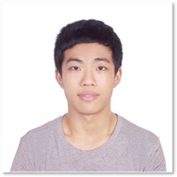

table {
  border: 1px solid black;
  table-layout: fixed;
  width: 200px;
}

th,
td {
  border: 1px solid black;
  width: 100px;
  overflow: hidden;
}
## About
<table>
  <tr>
    <td>
      
      
<a href="Kai_Gao_CV.pdf">CV</a>

      
 Email: kg627 [AT] scarletmail.rutgers.edu

    </td>
    <td>
      
 I'm a third-year doctoral student in Robotics at <a href="https://www.rutgers.edu/">Rutgers University</a>, working with Professor <a href="https://arc-l.github.io/">Jingjin Yu</a>. Currently, My research focuses on resolving combinatorial challenges in robot tasks and motion planning. Before arriving at Rutgers, I received a Bachelor's degree in Mathematics from <a href="http://en.ustc.edu.cn/"> the University of Science and Technology of China</a> in 2019.

    </td>
  </tr>
</table>

## Selected Projects
<table>
  <tr>
    <td>
      <video width="180" height="120" autoplay muted loop>
          <source src="https://user-images.githubusercontent.com/53358252/140593972-e803b282-1116-4a70-8777-70d2f5716515.mp4" type="video/mp4"> 
          
Your browser does not support the video tag.

      </video>
    </td>
    <td>
      
Fast High-Quality Tabletop Rearrangement in Bounded Workspace.

      
[<a href="media/ICRA_2022_TRLB_accompanying_video_compressed.mp4">video</a>]
      [<a href="https://arxiv.org/abs/2110.12325">paper</a>]
      [<a href="https://github.com/arc-l/TRLBr">codes</a>]

    </td>
  </tr>
  <tr>
    <td>
      <video width="180" height="120" autoplay muted loop>
          <source src="media/labeled_smaller_web.mp4" type="video/mp4"> 
          
Your browser does not support the video tag.

      </video>
    </td>
    <td>
      
[RSS 2021] On Minimizing the Number of Running Buffers for Tabletop Rearrangement.

      
[<a href="https://arc-l.github.io/pages/kai-rss-21.html">project page</a>]
      [<a href="https://www.youtube.com/watch?v=hbD-cumF_H4">video</a>]
      [<a href="http://www.roboticsproceedings.org/rss17/p033.pdf">paper</a>]
      [<a href="https://github.com/arc-l/running-buffer">codes</a>]

    </td>
  </tr>
  <tr>
    <td>      
      <video width="180" height="120" autoplay muted loop>
          <source src="https://user-images.githubusercontent.com/53358252/140593951-786298ca-7a7c-4cea-baf3-624ab57a1324.mp4" type="video/mp4"> 
          
Your browser does not support the video tag.

      </video>
    </td>
    <td>
      
[IROS 2021] Capacitated Vehicle Routing with Target Geometric Constraints.

      
[<a href="media/iros_pre_recorded_video_v3_compressed.mp4">video</a>]
      [<a href="https://arxiv.org/pdf/2107.10382.pdf">paper</a>]

    </td>
  </tr>
</table>

## Publications

**K. Gao** and J. Yu. "Capacitated Vehicle Routing with Target Geometric Constraints." 2021 IEEE/RSJ International Conference on Intelligent Robots and Systems (IROS 2021).

**K. Gao**, S. W. Feng, and J Yu. "On Minimizing the Number of Running Buffers for Tabletop Rearrangement." 2021 Robotics: Science and Systems (RSS 2021).

R. Wang\*, **K. Gao** \*, D. Nakhimovich\*, J. Yu, and K. E. Bekris. "Uniform Object Rearrangement: From Complete Monotone Primitives to Efficient Non-Monotone Informed Search." 2021 IEEE International Conference on Robotics and Automation (ICRA 2021).

S. W. Feng, **K. Gao**, J. Gong, and J. Yu. "Sensor Placement for Globally Optimal Coverage of 3D-Embedded Surfaces." 2021 IEEE International Conference on Robotics and Automation (ICRA 2021).

S. W. Feng, S. D. Han, **K. Gao**, and J. Yu. "Efficient Algorithms for Optimal Perimeter Guarding." 2019 Robotics: Science and Systems (RSS 2019).

## Papers Under Review
**K. Gao**, D. Lau, B. Huang, K. E. Bekris and J. Yu. "Fast High-Quality Tabletop Rearrangement in Bounded Workspace." submitted to 2022 IEEE International Conference on Robotics and Automation (ICRA 2022).

E. R. Vieira, D. Nakhimovich, **K. Gao**, R. Wang, J. Yu and K. E. Bekris. "Fast High-Quality Tabletop Rearrangement in Bounded Workspace." submitted to 2022 IEEE International Conference on Robotics and Automation (ICRA 2022).

